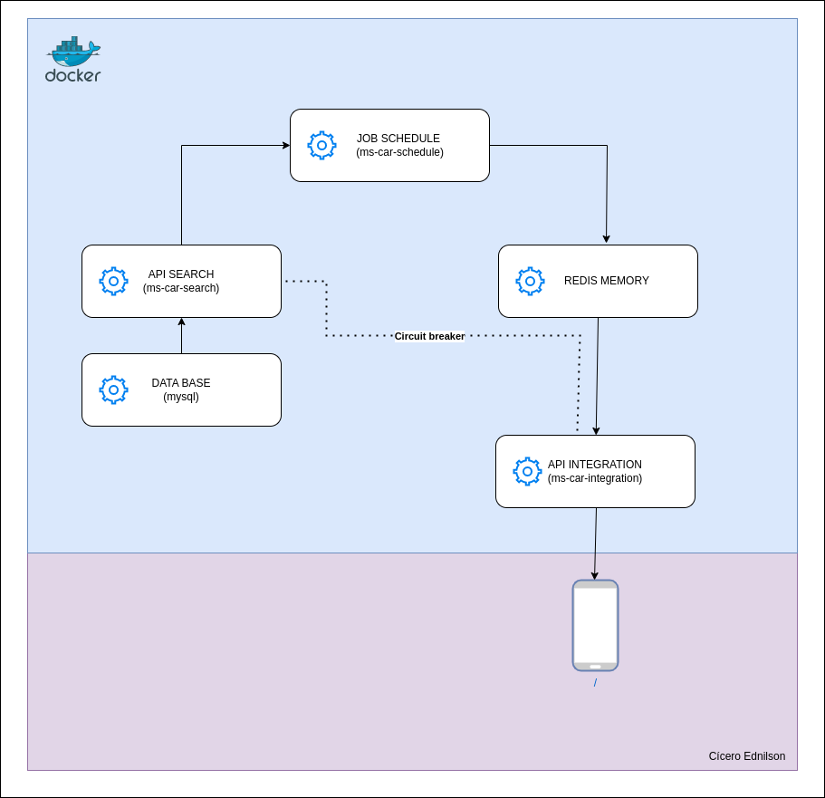
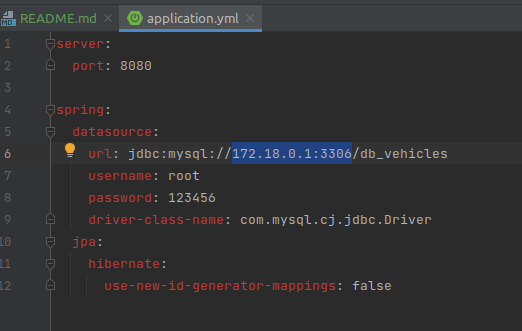
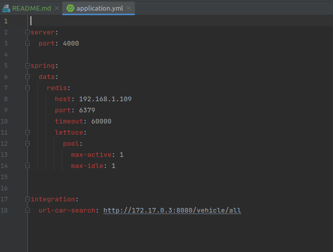
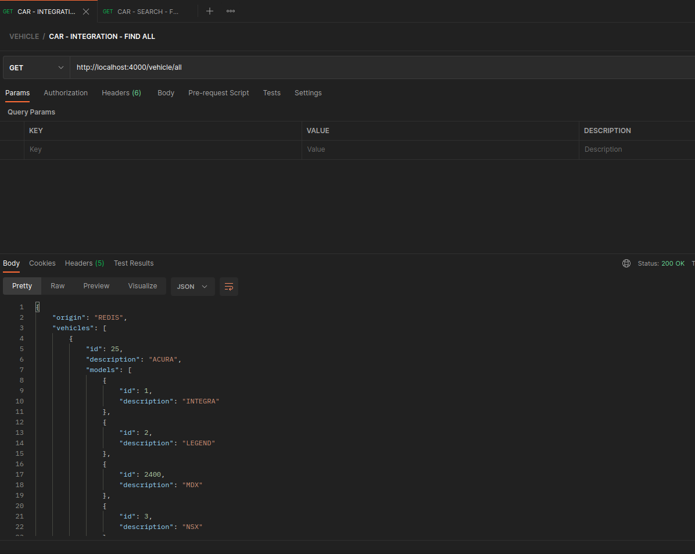
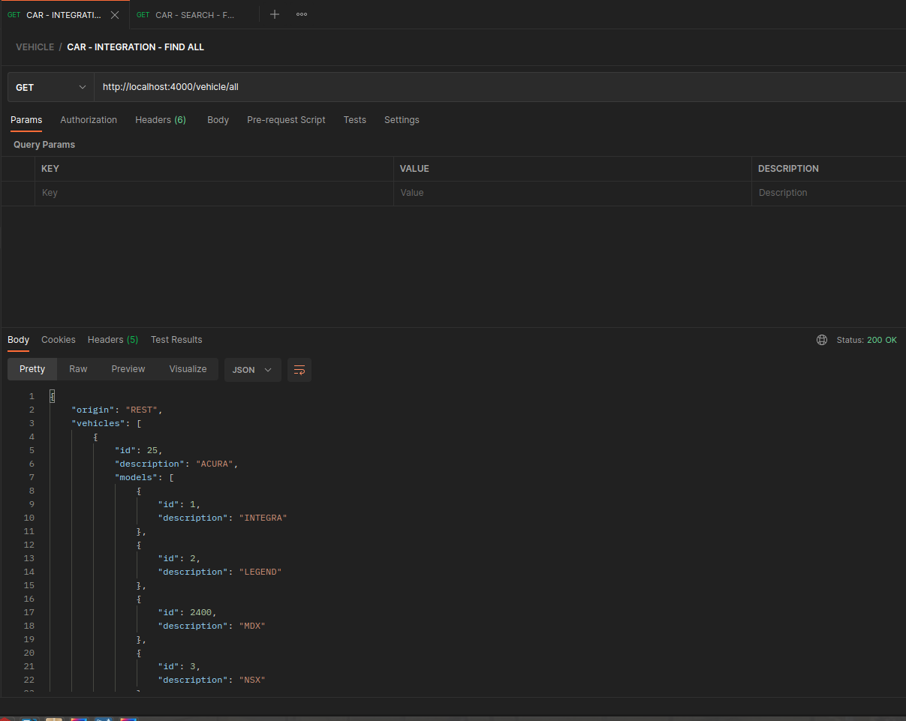

# PROJETO PARA MOSTRAR COMO FUNCIONA O QUARTZ, REDIS E RESILIENCE4J

Os serviços desse projeto foram desenvolvidos usando Java e Kotlin.

## ⚙️ Código fonte

* [ms-car-search](ms-car-search) - Esse serviço tem a funcionalidade de consultar os dados dos veículos no MySQL.
* [ms-car-schedule](ms-car-schedule) - Esse serviço tem a funcionalidade de consultar os veículos no serviço [ms-car-search](ms-car-search) e enviar para o Redis. 
* [ms-car-integration](ms-car-integration) - Esse serviço tem a funcionalide de buscar os dados no Redis, e caso o Redis esteja fora do ar, ele vai buscar os dados no serviço [ms-car-search](ms-car-search).

## 🚀 Começando

Esse projeto tem como principal objetivo mostrar o uso do Quartiz e Resilience4j.

## 🛠 Tecnologias usadas no projeto

<ol>
  <li>Java</li>
  <li>Kotlin</li>
  <li>Intellij</li>
  <li>Postman</li>
  <li>Mysql</li>
  <li>Mysql Workbench</li>
  <li>Quartz</li>
  <li>Spring Boot</li>
  <li>Redis</li>
  <li>Redis Desktop Manager</li>
  <li>Resilience4j</li>
  <li>Gradle</li>
  <li>Docker</li>
</ol>

## 📋 Pré-requisitos

Abaixo podemos ver as ferramentas necessárias para executar e testar o projeto.

<ol>
  <li>Java</li>
  <li>Intellij</li>
  <li>Postman</li>
  <li>Mysql</li>
  <li>Mysql Workbench</li>
  <li>Docker</li>
  <li>Redis Desktop Manager</li>
</ol>

## ⚙️ Arquitetura do projeto

## ⚙️ Docker - Criando uma rede.

Para que todos containers tenham comunicação entre entre eles, precisamos criar uma rede, para isso, basta executar o comando abaixo,
~~~~shell
docker network create -d bridge ciceroednilson
~~~~

## ⚙️ Docker - Instalando o MySQL.

Para instalar o MySQL, basta executar os comandos abaixo.
~~~~shell
docker pull mysql    
~~~~

~~~~shell
docker run -p 3306:3306 --network=ciceroednilson --hostname base-mysql --name base-mysql -e MYSQL_ROOT_PASSWORD=123456 -d mysql:latest
~~~~

## ⚙️ Docker - Instalando o Redis.

Para instalar o Redis, basta executar os comandos abaixo.

~~~~shell
docker pull redis
~~~~

~~~~shell
docker run -p 6379:6379 --name server-redis -d --network=ciceroednilson redis --appendonly yes
~~~~

## ⚙️ Criando Banco de Dados no MySQL.

~~~~sql
CREATE DATABASE `db_vehicles`;
~~~~

## ⚙️ Criando a tabela de Marcos de Veículos.

~~~~sql
CREATE TABLE IF NOT EXISTS tb_car_brands(
   `id` 		   INT NOT NULL PRIMARY KEY AUTO_INCREMENT,
   `description`   VARCHAR(100) NOT NULL
);
~~~~

## ⚙️ Criando a tabela de Modelos de Veículos.

~~~~sql
CREATE TABLE IF NOT EXISTS tb_car_models(
   `id` 		   INT NOT NULL PRIMARY KEY AUTO_INCREMENT,
   `id_brand`      INT NOT NULL, 
   `description`   VARCHAR(100) NOT NULL,
    FOREIGN KEY (id_brand) REFERENCES tb_car_brands(id)
);
~~~~

## ⚙️ Importando o arquivo que tem as marcas dos veículos.

O arquivo se encontra na pasta [files-to-load-data-base](files-to-load-data-base) com o nome de **marcas-carros.csv**.

Para importar o arquivo você precisa mudar o caminho no script abaixo.

~~~~sql
ALTER TABLE tb_car_brands AUTO_INCREMENT = 535;

LOAD DATA LOCAL INFILE '/home/cicero/projects/migration-iintegration/data-sql/marcas-carros.csv' 
INTO TABLE tb_car_brands 
FIELDS TERMINATED BY ';' 
ENCLOSED BY '"'
LINES TERMINATED BY '\r\n'
IGNORE 1 ROWS;
~~~~

## ⚙️ Importando o arquivo que tem os modelos dos veículos.

O arquivo se encontra na pasta [files-to-load-data-base](files-to-load-data-base) com o nome de **modelos-carro.csv**.

Para importar o arquivo você precisa mudar o caminho no script abaixo.

~~~~sql
ALTER TABLE tb_car_models AUTO_INCREMENT = 5029;

LOAD DATA LOCAL INFILE '/home/cicero/projects/migration-iintegration/data-sql/modelos-carro.csv' 
INTO TABLE tb_car_models 
FIELDS TERMINATED BY ';' 
ENCLOSED BY '"'
LINES TERMINATED BY '\r\n'
IGNORE 1 ROWS;
~~~~

## ⚙️ Docker - Criando o container do serviço ms-car-search.

Antes de criarmos a imagem e container para o serviço de buscar no MySQL, devemos pegar o ip do container, podemos fazer isso executando o comando abaixo.

~~~~shell
docker inspect \
  -f '{{range.NetworkSettings.Networks}}{{.IPAddress}}{{end}}' ID_DO_CONTAINER
~~~~

Depois de pegar o IP do container do MySQL, devemos adicionar ao arquivo application.yml na configuração de acesso ao banco.

Na pasta raiz do projeto, basta executar o comando abaixo para a criação da imagem.
~~~~shell
docker build -f Dockerfile -t img-ms-car-search .
~~~~

Depois podemos executar o comando abaixo para criar o container.
~~~~shell
docker run -d -p 8080:8080 img-ms-car-search:latest --hostname ms-car-search --name ms-car-search --network=ciceroednilson
~~~~

## ⚙️ Docker - Criando o container do serviço ms-car-schedule.

Antes de criar a imagem, devemos pegar o IP do container do Redis e do serviço ms-car-search, e então alterar o arquivo appication.yml

Caso o container desse projeto tenha problema ao acessar o container do Redis, podemos colocar o IP da máquina HOST.

Na pasta raiz do projeto, basta executar o comando abaixo para a criação da imagem.
~~~~shell
docker build -f Dockerfile -t img-ms-car-schedule .
~~~~

Depois podemos executar o comando abaixo para criar o container.
~~~~shell
docker run -d -p 9090:9090 img-ms-car-schedule:latest --hostname ms-car-schedule --name ms-car-schedule --network=ciceroednilson
~~~~

## ⚙️ Docker - Criando o container do serviço ms-car-integration.

Antes de criar a imagem e o container, precisamos pegar o IP do Redis e do serviço ms-car-search, e então adiconar ao application.yml do serviço.

Caso o container desse projeto tenha problema ao acessar o container do Redis, podemos colocar o IP da máquina HOST.

Na pasta raiz do projeto, basta executar o comando abaixo para a criação da imagem.
~~~~shell
docker build -f Dockerfile -t img-ms-car-integration .
~~~~

Depois podemos executar o comando abaixo para criar o container.
~~~~shell
docker run -d -p 4000:4000 img-ms-car-integration:latest --hostname ms-car-integration --name ms-car-integration --network=ciceroednilson
~~~~

## ⚙️ Docker - Containers em execução.

Com o comando abaixo, já é possível ver os containers em execução.
~~~~shell
docker container ps
~~~~

## 🔩 Testando a API pelo Postman. 

No primeiro teste vamos ver que os dados estão sendo retornado do Redis através do campo "origen".

No Segundo teste o Redis está fora do ar, e com isso o Circuit breaker vai transferir a consulta para a api ms-car-search. 

## 📌 Versão

1.0

## ✒️ Autor

Cícero Machado - ciceroednilson@gmail.com
